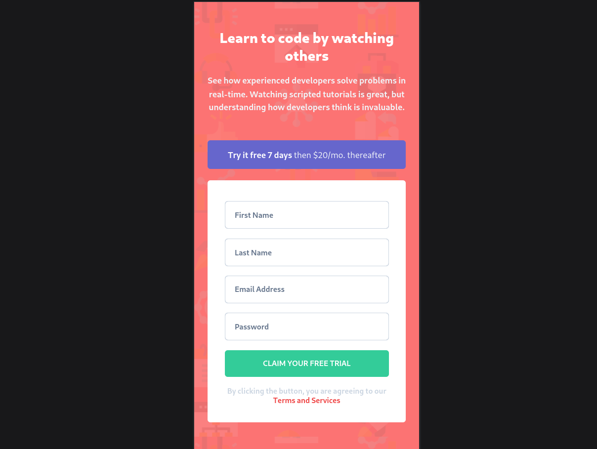

# Frontend Mentor -  intro-component-with-signup-form-master
[Live site URL here](https://form-validation-frontendmentor.netlify.app/)

This is a solution to the [intro-component-with-signup-form-master](https://www.frontendmentor.io/challenges/intro-component-with-signup-form-5cf91bd49edda32581d28fd1/hub). Frontend Mentor challenges help you improve your coding skills by building realistic projects.

## Table of contents

- [Overview](#overview)
  - [The challenge](#the-challenge)
  - [Screenshot](#screenshot)
  - [Links](#links)
- [My process](#my-process)
  - [Built with](#built-with)
  - [Useful resources](#useful-resources)
- [Author](#author)

## Overview

### The challenge

Users should be able to:

- View the optimal layout for the interface depending on their device's screen size
- See hover and focus states for all interactive elements on the page

### Screenshot

### Links

- Solution URL: [Solution URL here](https://github.com/BABAR1532/intro-component-with-signup-form-master)
- Live Site URL: [Live site URL here](https://form-validation-frontendmentor.netlify.app/)

## My process

### Built with

- Semantic HTML5 markup
- CSS custom properties
- Tailwind CSS
- Vanilla Javascript 

### Useful resources

- [Taliwind CSS](https://tailwindcss.com/docs/installation/using-postcss) - Getting started with tailwind CSS
- [Author](#author)
  - Coded by Ankit Kumar
  - Frontend Mentor profile [@BABAR1532](https://www.frontendmentor.io/profile/BABAR1532)
